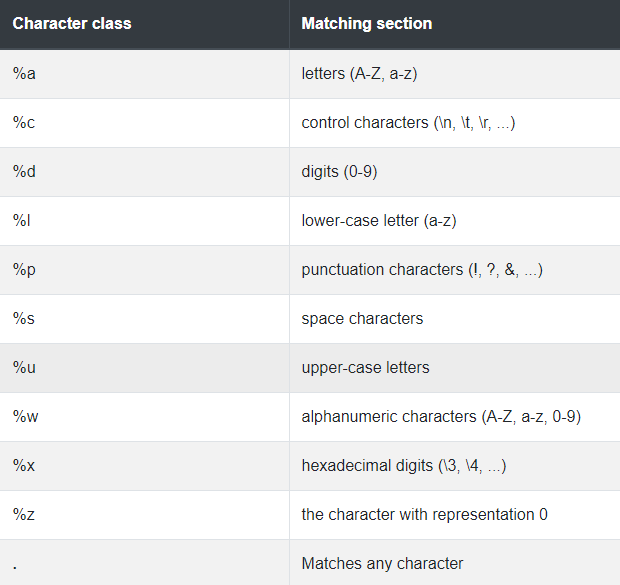
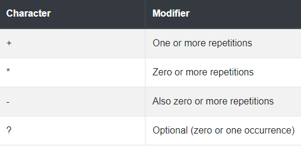
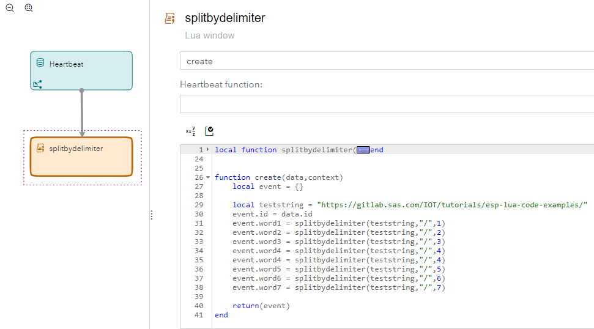
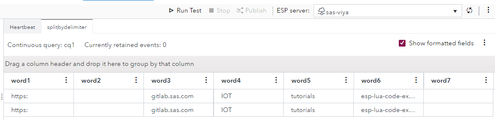
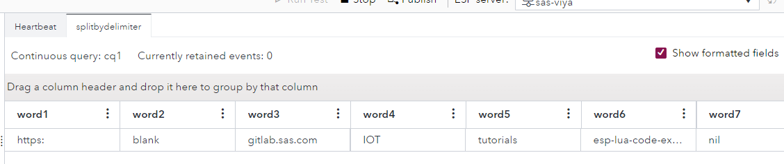

# Split String by Delimiter

This project will give an example of a custom function which can be used to split an incoming string by a user defined delimiter.  For fun we will also create a module for various string related functions and show how these modules are included in your programs. 

## Table of Contents

[toc]

* (Table of Contents)[#table-of-contents]

## Overview

Let's say you have the following string: 

```http
https://gitlab.sas.com/IOT/tutorials/esp-lua-code-examples/
```

You would like to parse out the 3rd word of this string where a word is anything delimited by the "/" symbol.   Lua does not provide a straight forward way of parsing string in this way.  Moreover, Lua does not support regex so we can't use that either.   Instead of using regex, the Lua string library has a special set of characters used in syntax matches. Both can be very similar, but Lua pattern matching is more limited and has a different syntax.   If you are like me and find regex infinitely confusing, this dumbed down version might just hit the sweet spot.  Detailed information can be found on this [tutorial website](https://riptutorial.com/lua/example/20315/lua-pattern-matching).  The Lua character classes look like this: 

 


As with regex you will also need the ability to specify modifiers that help with repetition of patterns.

 

Now let's use these pattern matching classes to create a function that will split our string on a word boundary. 

## Split Function

To make things easy I have written the following split by delimiter function.  Let's take a look at it and try and decipher just what it is doing. 

```lua
local function splitbydelimiter(
    s,   -- string value
    delimiter,  -- string value with defines the delimiter. default is ","
    item )   -- number: (optional) item in array to return.  
             -- Let's say you want the 3rd item parsed from string  "item1,item2,item3"
             -- If you say 2 item2 will be returned.  
             -- Note that Lua arrays start at 1 and not 0.  
    -- returns table of split items or item entry 
    answer = {};
    delimiter1 = delimiter or ","
    for word in string.gmatch(s,"(.-)"..delimiter1) do
        table.insert(answer, word);
        print ("word result...............................", word )
    end
    print ("answer .... ", #answer)
    if #answer == 0 then result = nil    -- return nil if nothing found. 
    elseif item then  -- does the user want an entry verses a parsed table?
        if #answer >= item then 
            result = answer[item]
        else result = nil     
        end 
    else  result = answer    
    end 
return result;
end
```


The function requires only 1 parameter which is the string to parse and returns either a table of parsed words or an individual item.  Programmers choice here.  If nothing is found it returns nil.  I always like my functions to return nil because it makes check for valid results very easy.  For example, 

```lua
if splitbydelimiter('IOT/tutorials/esp-lua-code-examples/') then 
    -- we found something 
end 
```

The optional parameters are the delimiter which defaults to ',' and the item.   If an item number isn't set then a table is returned which contains each word in order.   The heavy lifting of the function is done with this line.

```lua
for word in string.gmatch(s,"(.-)"..delimiter1) do
```

We are passing gmatch 2 things,  the string to parse and the pattern.  Let's break it down

- ".-"  Matches any character and 0 or more repetitions of any character 
- ()    The sub pattern within the pattern you want to capture.  We want to capture the word without the delimiter. 
- '..'   In Lua this is string concatenation.  Our pattern will be the first string concatenated to the contents of the delimiter1 variable.

If we use a delimiter of '/'  our pattern passed to gmatch would be "(.-)/"

if our string was "https://gitlab.sas.com/IOT/tutorials/esp-lua-code-examples/"  it would break down as follows: 

1. https:
2. blank
3. gitlab.sas.com
4. IOT
5. tutorials
6. esp-lua-code-examples
7. nil

## ESP Example

Now let's put this code in an ESP project and see what happens.  Please see the ESP_Projects folder of this repository for examples.  For testing I simply created 2 windows.  A Timer window that generates an event once per minute and a Lua window with a hardcoded string.  We call back to our local function which is typed directly into our main code. 

 

The output of 2 timer pops looks as follows:  



It is hard to tell the difference using ESP studio between a blank and a nil value.  So let's add a couple lines of code to our project and see if it becomes more clear. 

```lua
if event.word2 == nil  then event.word2 = "nil"  
else event.word2 = "blank"    
end 
if event.word7 == nil  then event.word7 = "nil"  end 
```

 

Now it is more clear that word2 is set to something other than nil.  While the function returned nil because there is not a 7th word in our string.   Isn't coding great? 

## Using Modules

If you have code which you want to reuse many times it is good to group them into modules and then just import those modules at the top of your Lua program.  Much like the import function in Python except Lua calls it require.  You can use modules to create classes which define objects or you can simply use them to group like minded functions together in a logical fashion.  In this example, I will group a few string type functions into a module called TTStrings and include that at the top of our program.   

```lua
local tttstrings  = require ("/export/sas-viya/lua/TTstrings")  -- group of string functions
local TTstr = tttstrings:new()

function create(data,context)
    local event = {}
    
    local teststring = "https://gitlab.sas.com/IOT/tutorials/esp-lua-code-examples/"
    event.id = data.id
    event.word1 = TTstr:splitbydelimiter(teststring,"/",1)
    event.word2 = TTstr:splitbydelimiter(teststring,"/",2)
    event.word3 = TTstr:splitbydelimiter(teststring,"/",3)
    event.word4 = TTstr:splitbydelimiter(teststring,"/",4)
    event.word4 = TTstr:splitbydelimiter(teststring,"/",4)
    event.word5 = TTstr:splitbydelimiter(teststring,"/",5)
    event.word6 = TTstr:splitbydelimiter(teststring,"/",6)
    event.word7 = TTstr:splitbydelimiter(teststring,"/",7)
    
    if event.word2 == nil  then event.word2 = "nil"  
    else event.word2 = "blank"    
    end 
    if event.word7 == nil  then event.word7 = "nil"  end 
    
    return(event)
end
```

This line pulls the TTstrings.lua module into memory and gives you a reference to it.  

```lua
local tttstrings  = require ("/export/sas-viya/lua/TTstrings")  -- group of string functions
```

This line creates an instance of the class and assigns that to another variable.  All the functions inside that module are now available using the TTstr variable.

```lua
local TTstr = tttstrings:new()
```

## Summary

Lua is a very powerful addition to the ESP tool bag. It is fast and provides many facilities for table manipulations, math operations, xml and json strings management. Best of all as you have seen here it is very easily extendable to whatever your needs require.

## Contributing

This project does not accept contributions.

## License

This project is licensed under the [SAS License Agreement for Corrective Code or Additional Functionality](LICENSE).

## Additional Resources

**Required**. Include any additional resources that users may need or find useful when using your software. Additional resources might include the following:

* [Lua Pattern Matching](https://riptutorial.com/lua/example/20315/lua-pattern-matching)
* SAS Global Forum papers
* Blog posts
* SAS Communities
* Other SAS Documentation (Tech Support, Education)
